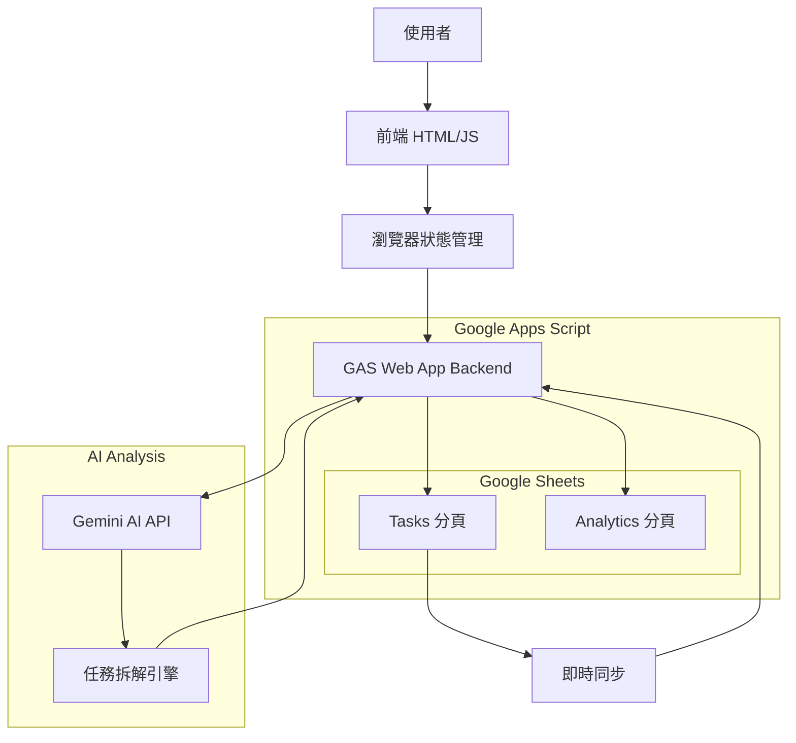

# 📋 Atomic Task Matrix

> 結合艾森豪矩陣與原子習慣的任務管理系統,透過 AI 智能拆解讓任務從「想」到「做」零阻力。

---

## 🧭 專案簡介

Atomic Task Matrix 是一個輕量級的任務管理工具,核心理念是「完成比完美重要」。透過艾森豪矩陣的四象限分類,搭配 Gemini AI 的原子習慣拆解能力,將「我要開始運動」這樣的大目標拆解成「穿上襪子」這樣的微小行動,徹底消除拖延的起始阻力。所有資料即時同步至 Google Sheets,確保資料安全且便於後續分析。

---

## 🚀 核心特色

- ✅ **四象限拖曳分類** - 直覺的拖放介面,快速區分任務優先級
- 📐 **左右分欄布局** - 左側待分類區（320px）+ 右側四象限（2x2），從左往右拖曳更符合閱讀習慣
- 🤖 **AI 智能拆解** - 運用 Gemini API 將大任務拆解成可立即執行的微行動
- 🌱 **任務強度標示** - AI 自動標註任務時間成本（🌱 ≤2分鐘、⚡ 5-10分鐘、🚀 15-30分鐘）
- ☁️ **Google Sheets 即時同步** - 所有操作即時儲存,連線狀態清楚呈現
- 📊 **完成率追蹤** - 每週統計平均任務存活時間,了解執行效率
- 🎯 **待分類緩衝區** - 新任務先進入緩衝區,思考後再分類
- 🔗 **任務關聯追蹤** - 拆解後的子任務與原任務保持清晰關聯

---

## 🏗️ 系統架構



**架構說明:**
- **前端層**: 模組化 JavaScript 架構（12 個模組，5 層架構），使用 Tailwind 4.0 CDN 處理樣式
- **狀態管理**: 即時操作直接同步到 Google Sheets,不使用 localStorage 避免資料不一致
- **資料層**: Google Sheets 作為雲端資料庫,分為 Tasks(任務資料) 和 Analytics(統計資料) 兩個分頁
- **AI 層**: Gemini API (`gemini-2.0-flash`) 負責任務拆解與強度標註,按需觸發不佔用不必要額度
- **任務強度系統**: 前端解析 emoji 前綴（🌱⚡🚀）並渲染 Memphis 風格 badges,後端透過改進的 Prompt 確保 AI 輸出包含強度標示

---

## 🧰 技術棧

| 類別 | 技術 | 版本/說明 |
|------|------|-----------|
| 前端框架 | Vanilla JavaScript | ES6+ 語法,無框架依賴 |
| 樣式系統 | Tailwind CSS | 4.0 via CDN |
| 拖曳功能 | HTML5 Drag & Drop API | 原生支援,無需第三方套件 |
| 雲端儲存 | Google Sheets API | v4 - RESTful API |
| AI 分析 | Google Gemini API | gemini-2.0-flash 模型 |
| 部署方式 | 靜態網頁託管 | Zeabur / Netlify / Vercel |
| 開發工具 | Live Server | VS Code 擴充套件即可 |

---

## ⚙️ 專案結構

```bash
atomic-task-matrix/
├─ index.html              # 主 HTML 檔案
├─ config.js               # API 設定檔(部署時建立,需手動管理 Git)
├─ tailwind-config.js      # Tailwind CSS 配置（Memphis 設計系統）
├─ core/                   # Layer 1-2: 基礎與配置
│  ├─ constants.js         # 狀態標籤、顏色定義、任務強度常數 (66 lines)
│  ├─ icons.js             # Heroicons SVG 圖標庫
│  ├─ config.js            # API 配置管理
│  └─ state.js             # 全域狀態與 DOM 引用
├─ models/                 # Layer 1: 資料模型
│  └─ Task.js              # 任務資料模型類別 (含強度解析邏輯, 103 lines)
├─ services/               # Layer 3: 服務層
│  └─ BackendGateway.js    # Google Apps Script API 通訊
├─ handlers/               # Layer 4: 互動處理
│  └─ DragDropHandler.js   # 拖放功能處理
├─ managers/               # Layer 4: 業務邏輯
│  └─ TaskManager.js       # 任務管理核心邏輯
├─ monitors/               # Layer 4: 監控
│  └─ ConnectionMonitor.js # 連線狀態監控
├─ ui/                     # Layer 4: UI 元件
│  ├─ Renderer.js          # UI 渲染與更新 (含強度 badge 渲染)
│  ├─ ConfirmDialog.js     # 確認對話框元件
│  └─ FeedbackToast.js     # Toast 通知元件
├─ app/                    # Layer 5: 應用啟動
│  ├─ events.js            # 事件綁定
│  └─ bootstrap.js         # 應用初始化
└─ gas/                    # Google Apps Script 後端
   └─ backend.gs           # GAS Web App 後端程式碼 (含 Gemini Prompt 與資安防護)
```

**架構設計原則:**
- **模組化架構**: 12 個模組分為 5 層,單向依賴流,無循環依賴
- **配置分離**: API 設定獨立於 `config.js`,避免版本控制洩漏
- **無建構流程**: 直接載入 script,不需要打包工具
- **清晰職責**: 每個模組有明確的單一職責

---

## 🧑‍💻 安裝與使用

### 前置需求

1. Google Cloud Platform 專案
2. 啟用以下 API:
   - Google Sheets API
   - Google Gemini API (AI Studio)
3. 建立 API 金鑰並設定權限

### 快速開始

```bash
# 1️⃣ 複製專案
git clone https://github.com/yourusername/atomic-task-matrix.git
cd atomic-task-matrix

# 2️⃣ 設定 API 金鑰
cp config.example.js config.js
# 編輯 config.js 填入你的 API 金鑰

# 3️⃣ 建立 Google Sheets
# 參考 SPEC.md 第 4 章的資料結構說明，建立包含以下分頁的試算表：
# - Tasks 分頁（8 欄：id, title, status, parent_task_id, parent_task_title, created_at, updated_at, completed_at）
# - Analytics 分頁（7 欄：week_start, week_end, total_created, total_completed, completion_rate, avg_lifetime_days, updated_at）
# 取得試算表 ID（URL 中的長字串）並設定到 gas/backend.gs 的 CONFIG.SPREADSHEET_ID

# 4️⃣ 啟動開發伺服器
# 使用 VS Code Live Server 或任何靜態伺服器
# 直接開啟 index.html 也可運作
```

### 後端 Web App (Google Apps Script)

- **程式碼位置**: `gas/backend.gs`
- **試算表 ID**: `YOUR_SPREADSHEET_ID` (請在 GAS backend.gs 中設定)
- **已部署 Web App URL**:
  `https://script.google.com/macros/s/YOUR_DEPLOYMENT_ID/exec`
- **Gemini AI 啟用**: 於 Apps Script「專案設定 → 指令碼屬性」新增 `GEMINI_API_KEY`
- **部署設定**: 執行身份「我自己」、存取權「任何人(含匿名)」
- **模型版本**: `gemini-2.0-flash` (穩定推薦版本)
- **⚠️ 重要**: 每次重新部署都會產生新的 URL,記得同步更新 `config.js`

### config.js 範例

```javascript
window.CONFIG = {
  API_BASE_URL: 'https://script.google.com/macros/s/YOUR_DEPLOYMENT_ID/exec'
};
```

**安全說明**: API_TOKEN 已從客戶端移除,後端使用 CSRF Token 機制提供防護。

---

## 🎯 使用流程

### 基本操作流程

1. **新增任務** → 任務出現在左側「待分類區」
2. **拖曳分類** → 從左側將任務往右拖到四象限之一(重要緊急/重要不緊急/不重要緊急/不重要不緊急)
3. **AI 拆解(可選)** → 點擊「🤖 AI 拆解」按鈕,Gemini 分析並生成帶有強度標示的子任務
   - 🌱 **小型任務** (≤2分鐘): 快速啟動行動,例如「穿上襪子」
   - ⚡ **中型任務** (5-10分鐘): 短時間專注,例如「整理桌面」
   - 🚀 **大型任務** (15-30分鐘): 持續投入,例如「撰寫專案報告」
4. **執行任務** → 從最小的子任務（🌱）開始執行,逐步進入工作狀態
5. **標記完成** → 點擊完成按鈕,任務從畫面消失但記錄在 Google Sheets
6. **查看統計** → 每週自動計算平均任務存活時間

### 任務強度系統說明

**自動標註**: AI 拆解時自動為每個子任務添加強度 emoji（🌱⚡🚀）
**視覺提示**: 任務卡片上會顯示彩色的強度 badge,滑鼠懸停可查看時間估計
**向後兼容**: 舊任務或手動建立的任務不會顯示強度標示,不影響正常使用

### 連線狀態說明

系統右上角會顯示即時連線狀態:
- 🟢 **已連線 Google Sheets** | 最後同步: X 分鐘前
- 🟡 **連線中...** (正在同步資料)
- 🔴 **連線失敗** (請檢查網路或 API 金鑰設定)

**重要**: 本系統不使用本地儲存,所有操作必須在連線狀態下進行。

---

## 🔐 安全性考量

### 資安修復狀態 (最後更新: 2025-11-04)

**Security Level**: 🟢 **Very Low Risk** (100% issues resolved: 3 fixed, 1 accepted)

| 編號 | 嚴重程度 | 問題描述 | 狀態 | 修復/接受日期 |
|------|----------|----------|------|---------------|
| H-01 | HIGH | DOM-based XSS 漏洞 | ✅ 已修復 | 2025-11-02 |
| M-01 | MEDIUM | 客戶端 API Token 暴露 | ✅ 已修復 | 2025-11-03 |
| M-02 | MEDIUM | Tailwind CDN 無 SRI 保護 | ✅ 已接受風險 | 2025-11-03 |
| L-01 | LOW | ALLOWED_ORIGIN 配置清理 | ✅ 已修復 | 2025-11-03 |

**M-02 風險接受說明**：Tailwind CDN 由 Cloudflare 託管，HTTPS 傳輸已足夠安全，核心防護（CSRF Token、XSS 防護）不受影響。自託管需 4-6 小時且破壞 Vanilla JS 架構優勢，經評估風險極低而選擇接受。

### 已實施的安全措施

**XSS 防護 (H-01)**:
- ✅ 所有使用者輸入使用 `createElement()` + `textContent` 安全渲染
- ✅ 僅內部受控函式（如 IconLibrary）使用 `innerHTML`
- ✅ 已實施 Content Security Policy (CSP)

**CSRF 防護 (M-01 + Token Rotation)**:
- ✅ 移除客戶端 API_TOKEN（無實際防護效果）
- ✅ 後端使用 Server-generated CSRF Token 機制
- ✅ 所有 POST/PUT/DELETE 請求包含 CSRF Token
- ✅ Token 單次使用,防止重放攻擊
- ✅ **Token Rotation 機制** (2025-11-04 新增):
  - 每次狀態變更操作（建立、更新、完成、刪除、AI 分解）都會返回新 token
  - 前端自動儲存新 token,支援無限連續操作
  - 符合 OWASP Synchronizer Token Pattern 最佳實踐
  - 修復了「第一次成功、第二次失敗」的連續操作 bug

**CORS 配置 (L-01)**:
- ✅ 移除誤導性 ALLOWED_ORIGIN 配置
- ✅ GAS Web App 預設允許所有來源（無法自訂）
- ✅ 透過 CSRF Token 機制提供跨站請求防護

**AI 安全防護 (2025-11-03)**:
- ✅ **Prompt Injection 防護**: 使用 `JSON.stringify()` 對使用者輸入進行轉義,防止 LLM 指令注入
- ✅ **LLM Output Validation**: 過濾 AI 輸出中的 HTML 標籤 `<tag>` 和試算表公式 `^[=+\-@]`
- ✅ **Enhanced sanitization**: 移除反斜線 `\` 和括號 `{}[]` 等可能的轉義字元
- ✅ 所有 AI 生成的任務標題經過多層驗證,確保不含惡意內容

### API 金鑰保護與 Git 管理

**config.js 管理策略**:
- ⚠️ config.js **不在** `.gitignore` 中（為支援 Zeabur 部署）
- ✅ **必須**使用選擇性 `git add <file>` 避免意外提交 config.js
- ❌ **禁止**使用 `git add .` 或 `git add -A`（會包含 config.js）
- 📖 詳見 [CLAUDE.md](CLAUDE.md) 的「Git Workflow & Deployment Security」章節

**安全評估**:
- ✅ GAS Web App URL 本身不構成安全風險（公開存取設計）
- ✅ 核心防護依賴 CSRF Token 機制（後端驗證）
- ⚠️ Gemini API Key 僅存於 GAS Script Properties,不暴露於前端
- 🔒 Git 歷史已完全清理,無 config.js 記錄

### Google Sheets 權限設定

- 試算表設定為「知道連結的人可以編輯」
- GAS 以部署者身份執行,控制資料存取權限
- 透過 CSRF Token 防止未授權的跨站請求

---

## 📦 部署

### 生產環境 (Current)

**平台**: Zeabur
**網址**: https://task-matrix.zeabur.app/
**前端**: 靜態檔案直接部署
**後端**: Google Apps Script Web App
**最後更新**: 2025-11-04
**最新更新**: 左右分欄布局優化 - 左側待分類（320px）+ 右側四象限，拖曳更直覺

### 靜態網頁託管 (推薦)

**Zeabur (當前使用):**
- 使用 Zeabur VS Code Extension 部署
- config.js 會自動包含在部署中（Extension 不受 .gitignore 限制）
- 適合需要 config.js 的專案
- 🚀 當前生產環境: https://task-matrix.zeabur.app/

**Netlify / Vercel:**
- 直接連接 GitHub Repository
- 部署時需手動上傳 `config.js` 或使用環境變數
- 自動化部署（需設定 config.js 處理策略）

**GitHub Pages:**
```bash
# 推送到 GitHub 後在設定中啟用 Pages
# ⚠️ 注意: 需手動處理 config.js（不推送到 GitHub）
```

**Git 操作重要提醒**:
- ✅ 推送代碼時使用: `git add <specific-files>`
- ❌ 禁止使用: `git add .` 或 `git add -A`
- 📖 詳細工作流程見 [CLAUDE.md](CLAUDE.md) 的 Git Workflow 章節

### 本地開發

**必須使用 VS Code Live Server 擴充套件**:
```bash
# 1. 安裝 VS Code Live Server 擴充
# 2. 右鍵 index.html → "Open with Live Server"
# 3. 瀏覽器自動開啟 http://127.0.0.1:5500/
```

**⚠️ 不要使用其他伺服器工具** (如 `python -m http.server` 或 `npm serve`),可能導致模組載入問題。

**環境檢查清單**:
- ✅ `config.js` 已正確設定
- ✅ 使用 VS Code Live Server
- ✅ 瀏覽器允許跨域請求 (GAS API CORS 已設定)

---

## 🧪 測試

由於是單一使用者工具,測試策略著重於:

### 手動測試檢查清單

- [ ] 四象限拖曳功能正常
- [ ] 待分類區可接收新任務
- [ ] 任務可從象限拖回待分類區
- [ ] AI 拆解按鈕觸發正確
- [ ] 拆解後的子任務顯示原任務關聯
- [ ] 完成任務後從畫面消失
- [ ] Google Sheets 資料正確同步
- [ ] 連線狀態燈號即時更新
- [ ] 每週統計數據計算正確

### 錯誤處理測試

- [ ] 網路斷線時的錯誤提示
- [ ] API 金鑰無效時的錯誤訊息
- [ ] Gemini API 額度用完時的提示
- [ ] 試算表不存在時的錯誤處理

---

## 🧩 相關文件

| 文件 | 說明 |
|------|------|
| [README.md](./README.md) | 專案總覽與技術架構 (本檔) |
| [PRD.md](./PRD.md) | 產品需求文件 - 使用者故事與驗收標準 |
| [SPEC.md](./SPEC.md) | 系統規格文件 - API 設計與資料結構 |

---

## 📈 未來擴充方向

雖然目前僅供個人使用,但架構已保留擴充性:

- 🔐 **多租戶支援** - Google 帳號登入，每位使用者擁有獨立任務空間（需設定 OAuth Client ID）
- 🔒 **防止過度拆解** - 子任務不可再次 AI 拆解，避免過度細碎化

---

## 📜 授權

本專案採用 MIT 授權 - 詳見 [LICENSE](LICENSE) 文件

Copyright © 2025 AtomTask

---

## 🤝 開發指南

### Commit 規範

採用 Conventional Commits:
- `feat:` 新增功能
- `fix:` 修復錯誤
- `docs:` 文件更新
- `style:` 程式碼格式調整
- `refactor:` 重構
- `test:` 測試相關

### 程式碼風格

- 使用 ES6+ 語法
- 函式命名使用 camelCase
- 常數使用 UPPER_SNAKE_CASE
- 適當的註解說明複雜邏輯

---

## 🆘 常見問題

**Q: 為什麼不使用 localStorage?**  
A: 為確保資料一致性與安全性,所有資料即時同步到 Google Sheets,避免本地與雲端資料不同步的問題。

**Q: Gemini API 免費額度夠用嗎?**  
A: 個人使用通常足夠,因為拆解功能是按需觸發,不是每個任務都會使用。

**Q: 可以離線使用嗎?**  
A: 目前不支援離線模式,未來可考慮加入 Service Worker 與本地快取。

**Q: 如何備份資料?**
A: 所有資料在 Google Sheets 中,可直接下載試算表或設定自動備份。

**Q: 任務強度標示（🌱⚡🚀）是如何運作的?**
A: AI 拆解時會根據任務複雜度自動添加 emoji 前綴,前端會解析這些 emoji 並顯示彩色 badges。舊任務或手動建立的任務不會有強度標示,但不影響使用。

**Q: 可以手動設定任務強度嗎?**
A: 目前強度標示由 AI 自動判斷。如果想手動設定,可以在任務標題前手動加入 🌱、⚡ 或 🚀 emoji,系統會自動識別並顯示對應的 badge。

**Q: 什麼是 CSRF Token Rotation 機制？**
A: 這是 2025-11-04 實施的安全強化功能。修復了之前「第一次拖放成功、第二次失敗」的問題。現在每次操作（建立、更新、完成、刪除、AI 分解）都會自動獲得新的安全 token，支援無限連續操作而無需刷新頁面。這符合 OWASP 推薦的安全標準，同時提升了使用體驗。
