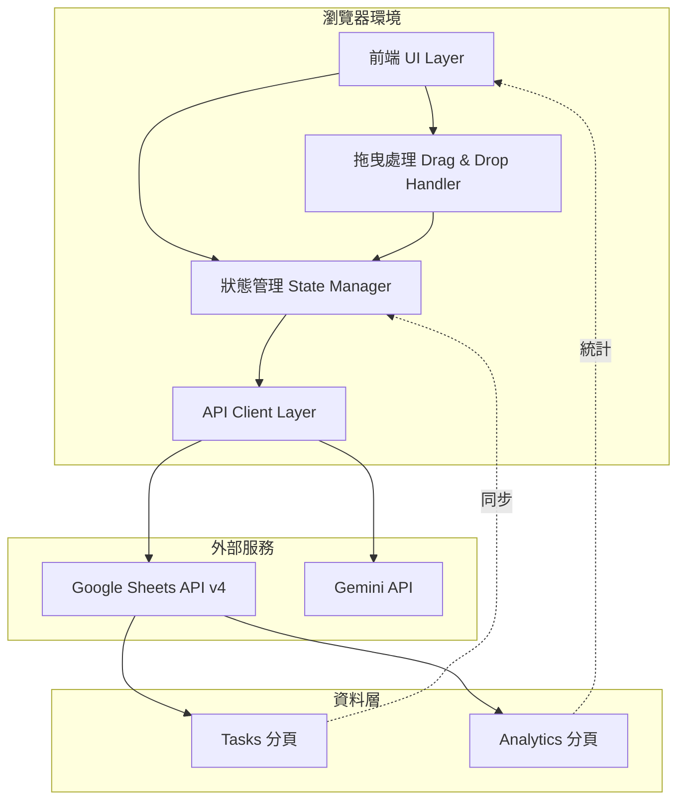

# 📘 SPEC - Atomic Task Matrix 系統規格文件

> 本文件為 **規格導向(SPP) + 測試驅動(TDD)** 標準模板,定義系統的資料結構、API 介面、前端架構與錯誤處理規範。

---

## 🧩 一、目的 (Purpose)

此文件旨在:
1. 定義 Google Sheets 資料結構作為雲端資料庫
2. 明確說明前端與 Google Sheets API / Gemini API 的互動方式
3. 提供前端狀態管理與 UI 元件規格
4. 建立錯誤處理與資料同步策略

---

## 🏗️ 二、系統架構 (Architecture Overview)



**架構層級說明:**

### 前端層 (Browser)
- **UI Layer**: 負責渲染四象限、待分類區、任務卡片、統計面板
- **State Manager**: 管理任務狀態、連線狀態、選中任務
- **Drag & Drop Handler**: 處理 HTML5 拖曳事件與視覺回饋
- **API Client Layer**: 封裝 Google Sheets API 與 Gemini API 呼叫

### 外部服務層 (External)
- **Google Sheets API**: RESTful API,用於 CRUD 任務資料
- **Gemini API**: 用於 AI 任務拆解

### 資料層 (Data)
- **Tasks 分頁**: 儲存所有任務(待分類、象限、已完成)
- **Analytics 分頁**: 儲存統計資料(每週彙總)

---

## 🧱 三、模組與責任劃分 (Modules & Responsibilities)

| 模組 | 功能說明 | 主要函式 | 輸入 | 輸出 |
|------|----------|----------|------|------|
| **TaskManager** | 任務 CRUD 操作 | `createTask()`, `updateTask()`, `deleteTask()`, `getTasksByStatus()` | 任務資料 | 任務物件 / 任務列表 |
| **SheetsClient** | Google Sheets API 封裝 | `readSheet()`, `appendRow()`, `updateRow()`, `batchUpdate()` | API 參數 | 試算表資料 / 操作結果 |
| **GeminiClient** | Gemini API 封裝 | `breakdownTask()` | 任務名稱 | 子任務陣列 |
| **DragDropHandler** | 拖曳事件處理 | `onDragStart()`, `onDragOver()`, `onDrop()` | 拖曳事件 | 任務狀態更新 |
| **StatisticsEngine** | 統計計算 | `calculateWeeklyStats()`, `getAverageLifetime()` | 完成任務資料 | 統計物件 |
| **ConnectionMonitor** | 連線狀態監控 | `checkConnection()`, `updateStatus()` | 無 | 連線狀態 |

---

## 📊 四、Google Sheets 資料結構

### 4.1 Tasks 分頁 (Sheet Name: "Tasks")

**表頭 (第一行):**
```
id | title | status | parent_task_id | parent_task_title | created_at | updated_at | completed_at
```

| 欄位名稱 | 欄位 | 型別 | 說明 | 範例值 | 必填 |
|----------|------|------|------|--------|------|
| `id` | A | STRING | 任務唯一識別碼 (UUID) | `task-a1b2c3d4` | ✓ |
| `title` | B | STRING | 任務名稱 | `我要開始運動` | ✓ |
| `status` | C | ENUM | 任務狀態 | `uncategorized` | ✓ |
| `parent_task_id` | D | STRING | 父任務 ID (子任務使用) | `task-001` 或空白 | |
| `parent_task_title` | E | STRING | 父任務名稱 (顯示用) | `我要開始運動` | |
| `created_at` | F | DATETIME | 建立時間 (ISO 8601) | `2025-11-01T10:30:00Z` | ✓ |
| `updated_at` | G | DATETIME | 最後更新時間 | `2025-11-01T11:00:00Z` | ✓ |
| `completed_at` | H | DATETIME | 完成時間 | `2025-11-01T15:00:00Z` 或空白 | |

**狀態定義 (status 欄位):**
- `uncategorized`: 待分類區
- `urgent_important`: 重要且緊急 (象限 1)
- `urgent_not_important`: 不重要但緊急 (象限 3)
- `not_urgent_important`: 重要但不緊急 (象限 2)
- `not_urgent_not_important`: 不重要也不緊急 (象限 4)
- `completed`: 已完成

**範例資料:**

| A (id) | B (title) | C (status) | D (parent_task_id) | E (parent_task_title) | F (created_at) | G (updated_at) | H (completed_at) |
|--------|-----------|------------|--------------------|-----------------------|----------------|----------------|------------------|
| task-001 | 我要開始運動 | completed | | | 2025-11-01T10:00:00Z | 2025-11-01T10:00:00Z | 2025-11-01T15:00:00Z |
| task-002 | 穿上襪子 | completed | task-001 | 我要開始運動 | 2025-11-01T10:05:00Z | 2025-11-01T10:05:00Z | 2025-11-01T10:30:00Z |
| task-003 | 換上運動服 | urgent_important | task-001 | 我要開始運動 | 2025-11-01T10:05:00Z | 2025-11-01T11:00:00Z | |

---

### 4.2 Analytics 分頁 (Sheet Name: "Analytics")

**表頭 (第一行):**
```
week_start | week_end | total_created | total_completed | completion_rate | avg_lifetime_days | updated_at
```

| 欄位名稱 | 欄位 | 型別 | 說明 | 範例值 | 必填 |
|----------|------|------|------|--------|------|
| `week_start` | A | DATE | 週起始日期 (週一) | `2025-10-27` | ✓ |
| `week_end` | B | DATE | 週結束日期 (週日) | `2025-11-02` | ✓ |
| `total_created` | C | INTEGER | 本週建立任務數 | `15` | ✓ |
| `total_completed` | D | INTEGER | 本週完成任務數 | `10` | ✓ |
| `completion_rate` | E | FLOAT | 完成率 (%) | `66.67` | ✓ |
| `avg_lifetime_days` | F | FLOAT | 平均任務存活天數 | `2.5` | ✓ |
| `updated_at` | G | DATETIME | 統計更新時間 | `2025-11-02T23:59:00Z` | ✓ |

**計算公式:**
```javascript
completion_rate = (total_completed / total_created) * 100
avg_lifetime_days = Σ(completed_at - created_at) / total_completed
// 時間差計算單位: 天 (精確到小數點後一位)
```

**範例資料:**

| A (week_start) | B (week_end) | C (total_created) | D (total_completed) | E (completion_rate) | F (avg_lifetime_days) | G (updated_at) |
|----------------|--------------|-------------------|---------------------|---------------------|----------------------|----------------|
| 2025-10-27 | 2025-11-02 | 15 | 10 | 66.67 | 2.5 | 2025-11-02T23:59:00Z |
| 2025-11-03 | 2025-11-09 | 12 | 9 | 75.00 | 1.8 | 2025-11-09T23:59:00Z |

---

## ⚙️ 五、API 規格

### 5.1 Google Sheets API (v4)

**Base URL**: `https://sheets.googleapis.com/v4/spreadsheets/{spreadsheetId}`

#### 5.1.1 讀取所有任務

**Endpoint**: `GET /values/Tasks!A:H`

**完整 URL 範例:**
```
https://sheets.googleapis.com/v4/spreadsheets/YOUR_SPREADSHEET_ID/values/Tasks!A:H?key=YOUR_API_KEY
```

**Response:**
```json
{
  "range": "Tasks!A:H",
  "majorDimension": "ROWS",
  "values": [
    ["id", "title", "status", "parent_task_id", "parent_task_title", "created_at", "updated_at", "completed_at"],
    ["task-001", "我要開始運動", "uncategorized", "", "", "2025-11-01T10:00:00Z", "2025-11-01T10:00:00Z", ""]
  ]
}
```

---

#### 5.1.2 新增任務 (Append)

**Endpoint**: `POST /values/Tasks!A:H:append`

**完整 URL 範例:**
```
https://sheets.googleapis.com/v4/spreadsheets/YOUR_SPREADSHEET_ID/values/Tasks!A:H:append?valueInputOption=USER_ENTERED&key=YOUR_API_KEY
```

**Request Body:**
```json
{
  "values": [
    ["task-002", "穿上襪子", "urgent_important", "task-001", "我要開始運動", "2025-11-01T10:05:00Z", "2025-11-01T10:05:00Z", ""]
  ]
}
```

**Response:**
```json
{
  "spreadsheetId": "YOUR_SPREADSHEET_ID",
  "updatedRange": "Tasks!A3:H3",
  "updatedRows": 1,
  "updatedColumns": 8,
  "updatedCells": 8
}
```

---

#### 5.1.3 更新任務狀態 (拖曳分類時使用)

**Endpoint**: `PUT /values/Tasks!C{rowNumber}`

**說明**: 更新特定行的 status 欄位 (C 欄)

**完整 URL 範例:**
```
https://sheets.googleapis.com/v4/spreadsheets/YOUR_SPREADSHEET_ID/values/Tasks!C3?valueInputOption=USER_ENTERED&key=YOUR_API_KEY
```

**Request Body:**
```json
{
  "values": [["urgent_important"]]
}
```

**Response:**
```json
{
  "spreadsheetId": "YOUR_SPREADSHEET_ID",
  "updatedRange": "Tasks!C3",
  "updatedRows": 1,
  "updatedColumns": 1,
  "updatedCells": 1
}
```

**註**: 更新前需先透過 `GET /values/Tasks!A:H` 找到任務對應的行號

---

#### 5.1.4 標記任務完成

**Endpoint**: `PUT /values/Tasks!C{rowNumber}:H{rowNumber}`

**說明**: 批次更新 status, updated_at, completed_at 欄位

**完整 URL 範例:**
```
https://sheets.googleapis.com/v4/spreadsheets/YOUR_SPREADSHEET_ID/values/Tasks!C3:H3?valueInputOption=USER_ENTERED&key=YOUR_API_KEY
```

**Request Body:**
```json
{
  "values": [
    ["completed", "", "", "2025-11-01T10:05:00Z", "2025-11-01T15:00:00Z", "2025-11-01T15:00:00Z"]
  ]
}
```

**欄位說明:**
- C: status → `completed`
- D: parent_task_id → 保持不變 (空字串)
- E: parent_task_title → 保持不變 (空字串)
- F: created_at → 保持不變
- G: updated_at → 更新為當前時間
- H: completed_at → 更新為當前時間

---

### 5.2 Gemini API

**Base URL**: `https://generativelanguage.googleapis.com/v1beta/models/gemini-pro:generateContent`

#### 5.2.1 任務拆解

**Endpoint**: `POST /v1beta/models/gemini-pro:generateContent`

**完整 URL 範例:**
```
https://generativelanguage.googleapis.com/v1beta/models/gemini-pro:generateContent?key=YOUR_GEMINI_API_KEY
```

**Request Body:**
```json
{
  "contents": [{
    "parts": [{
      "text": "請將以下任務拆解成 3-5 個極簡單的微小行動,每個行動都應該在 2 分鐘內可完成。任務:「我要開始運動」。回傳格式為 JSON 陣列,例如:[\"穿上襪子\", \"換上運動服\", \"做 5 分鐘暖身\"]。只回傳 JSON 陣列,不要有其他文字或說明。"
    }]
  }],
  "generationConfig": {
    "temperature": 0.7,
    "maxOutputTokens": 500
  }
}
```

**Response:**
```json
{
  "candidates": [{
    "content": {
      "parts": [{
        "text": "[\"穿上襪子\", \"換上運動服\", \"做 5 分鐘暖身\", \"走到運動區域\", \"開始第一組動作\"]"
      }]
    },
    "finishReason": "STOP"
  }]
}
```

**前端解析範例:**
```javascript
const response = await fetch(GEMINI_API_URL, { 
    method: 'POST', 
    headers: { 'Content-Type': 'application/json' },
    body: JSON.stringify(requestBody) 
});

const data = await response.json();
const rawText = data.candidates[0].content.parts[0].text;
const subtasks = JSON.parse(rawText); 
// 結果: ["穿上襪子", "換上運動服", "做 5 分鐘暖身", "走到運動區域", "開始第一組動作"]
```

**錯誤處理:**
- 若 Gemini 回傳非 JSON 格式,使用正規表達式提取 JSON 部分
- 若完全無法解析,顯示錯誤訊息並保留原任務

---

## 🖥️ 六、前端架構規格

### 6.1 核心 JavaScript 模組

```javascript
// ===== config.js (由使用者建立,不納入版本控制) =====
const CONFIG = {
    GOOGLE_SHEETS_API_KEY: 'your_api_key_here',
    SPREADSHEET_ID: 'your_spreadsheet_id_here',
    GEMINI_API_KEY: 'your_gemini_api_key_here'
};

// ===== 全域狀態管理 =====
const AppState = {
    tasks: [],              // 所有任務陣列
    selectedTask: null,     // 當前選中的任務 ID
    connectionStatus: 'disconnected', // 連線狀態
    lastSyncTime: null,     // 最後同步時間戳
    weeklyStats: null       // 每週統計物件
};

// ===== Task 類別定義 =====
class Task {
    constructor(title, status = 'uncategorized', parentTaskId = null, parentTaskTitle = null) {
        this.id = this.generateId();
        this.title = title;
        this.status = status;
        this.parent_task_id = parentTaskId;
        this.parent_task_title = parentTaskTitle;
        this.created_at = new Date().toISOString();
        this.updated_at = new Date().toISOString();
        this.completed_at = null;
    }
    
    generateId() {
        return 'task-' + Date.now() + '-' + Math.random().toString(36).substr(2, 9);
    }
    
    toSheetRow() {
        return [
            this.id,
            this.title,
            this.status,
            this.parent_task_id || '',
            this.parent_task_title || '',
            this.created_at,
            this.updated_at,
            this.completed_at || ''
        ];
    }
}
```

---

### 6.2 Google Sheets API Client

```javascript
const SheetsClient = {
    baseURL: `https://sheets.googleapis.com/v4/spreadsheets/${CONFIG.SPREADSHEET_ID}`,
    
    // 讀取所有任務
    async readAllTasks() {
        const url = `${this.baseURL}/values/Tasks!A:H?key=${CONFIG.GOOGLE_SHEETS_API_KEY}`;
        
        try {
            const response = await fetch(url);
            if (!response.ok) throw new Error('SHEETS_READ_ERROR');
            
            const data = await response.json();
            return this.parseTasksFromSheet(data.values);
        } catch (error) {
            console.error('Error reading tasks:', error);
            throw error;
        }
    },
    
    // 新增任務
    async appendTask(task) {
        const url = `${this.baseURL}/values/Tasks!A:H:append?valueInputOption=USER_ENTERED&key=${CONFIG.GOOGLE_SHEETS_API_KEY}`;
        
        try {
            const response = await fetch(url, {
                method: 'POST',
                headers: { 'Content-Type': 'application/json' },
                body: JSON.stringify({ values: [task.toSheetRow()] })
            });
            
            if (!response.ok) throw new Error('SHEETS_APPEND_ERROR');
            return await response.json();
        } catch (error) {
            console.error('Error appending task:', error);
            throw error;
        }
    },
    
    // 更新任務狀態
    async updateTaskStatus(taskId, newStatus) {
        // 1. 先讀取所有任務找到行號
        const tasks = await this.readAllTasks();
        const taskIndex = tasks.findIndex(t => t.id === taskId);
        if (taskIndex === -1) throw new Error('TASK_NOT_FOUND');
        
        const rowNumber = taskIndex + 2; // +2 因為有表頭且索引從 0 開始
        const url = `${this.baseURL}/values/Tasks!C${rowNumber}:G${rowNumber}?valueInputOption=USER_ENTERED&key=${CONFIG.GOOGLE_SHEETS_API_KEY}`;
        
        // 2. 更新 status 和 updated_at
        const updatedAt = new Date().toISOString();
        const response = await fetch(url, {
            method: 'PUT',
            headers: { 'Content-Type': 'application/json' },
            body: JSON.stringify({ 
                values: [[newStatus, '', '', '', updatedAt]] 
            })
        });
        
        if (!response.ok) throw new Error('SHEETS_UPDATE_ERROR');
        return await response.json();
    },
    
    // 標記任務完成
    async markTaskComplete(taskId) {
        const tasks = await this.readAllTasks();
        const taskIndex = tasks.findIndex(t => t.id === taskId);
        if (taskIndex === -1) throw new Error('TASK_NOT_FOUND');
        
        const rowNumber = taskIndex + 2;
        const url = `${this.baseURL}/values/Tasks!C${rowNumber}:H${rowNumber}?valueInputOption=USER_ENTERED&key=${CONFIG.GOOGLE_SHEETS_API_KEY}`;
        
        const now = new Date().toISOString();
        const response = await fetch(url, {
            method: 'PUT',
            headers: { 'Content-Type': 'application/json' },
            body: JSON.stringify({ 
                values: [['completed', '', '', '', now, now]] 
            })
        });
        
        if (!response.ok) throw new Error('SHEETS_UPDATE_ERROR');
        return await response.json();
    },
    
    // 解析試算表資料為 Task 物件
    parseTasksFromSheet(rows) {
        if (!rows || rows.length <= 1) return [];
        
        const [header, ...dataRows] = rows;
        return dataRows.map(row => ({
            id: row[0],
            title: row[1],
            status: row[2],
            parent_task_id: row[3] || null,
            parent_task_title: row[4] || null,
            created_at: row[5],
            updated_at: row[6],
            completed_at: row[7] || null
        }));
    }
};
```

---

### 6.3 Gemini API Client

```javascript
const GeminiClient = {
    baseURL: 'https://generativelanguage.googleapis.com/v1beta/models/gemini-pro:generateContent',
    
    async breakdownTask(taskTitle) {
        const prompt = `請將以下任務拆解成 3-5 個極簡單的微小行動,每個行動都應該在 2 分鐘內可完成。
任務:「${taskTitle}」
回傳格式為 JSON 陣列,例如:["動作1", "動作2", "動作3"]
重要:只回傳 JSON 陣列,不要有任何其他文字或說明。`;
        
        try {
            const response = await fetch(`${this.baseURL}?key=${CONFIG.GEMINI_API_KEY}`, {
                method: 'POST',
                headers: { 'Content-Type': 'application/json' },
                body: JSON.stringify({
                    contents: [{ parts: [{ text: prompt }] }],
                    generationConfig: { 
                        temperature: 0.7, 
                        maxOutputTokens: 500 
                    }
                })
            });
            
            if (!response.ok) {
                if (response.status === 429) throw new Error('GEMINI_QUOTA_EXCEEDED');
                throw new Error('GEMINI_API_ERROR');
            }
            
            const data = await response.json();
            const rawText = data.candidates[0].content.parts[0].text;
            
            // 嘗試解析 JSON
            try {
                return JSON.parse(rawText);
            } catch {
                // 若直接解析失敗,嘗試提取 JSON 部分
                const jsonMatch = rawText.match(/\[.*\]/s);
                if (jsonMatch) {
                    return JSON.parse(jsonMatch[0]);
                }
                throw new Error('PARSE_ERROR');
            }
        } catch (error) {
            console.error('Gemini API error:', error);
            throw error;
        }
    }
};
```

---

### 6.4 拖曳事件處理

```javascript
const DragDropHandler = {
    // 拖曳開始
    onDragStart(event) {
        const taskCard = event.target.closest('.task-card');
        const taskId = taskCard.dataset.taskId;
        
        event.dataTransfer.effectAllowed = 'move';
        event.dataTransfer.setData('taskId', taskId);
        
        taskCard.classList.add('dragging');
    },
    
    // 拖曳經過目標區域
    onDragOver(event) {
        event.preventDefault();
        event.dataTransfer.dropEffect = 'move';
        
        const dropZone = event.currentTarget;
        dropZone.classList.add('drag-over');
    },
    
    // 拖曳離開目標區域
    onDragLeave(event) {
        const dropZone = event.currentTarget;
        dropZone.classList.remove('drag-over');
    },
    
    // 放下任務
    async onDrop(event) {
        event.preventDefault();
        
        const dropZone = event.currentTarget;
        dropZone.classList.remove('drag-over');
        
        const taskId = event.dataTransfer.getData('taskId');
        const targetStatus = dropZone.dataset.status;
        
        // 更新任務狀態並同步到 Google Sheets
        await TaskManager.updateTaskStatus(taskId, targetStatus);
    },
    
    // 拖曳結束
    onDragEnd(event) {
        const taskCard = event.target.closest('.task-card');
        taskCard.classList.remove('dragging');
        
        // 移除所有 drag-over 樣式
        document.querySelectorAll('.drag-over').forEach(zone => {
            zone.classList.remove('drag-over');
        });
    }
};
```

---

## ⚡ 七、錯誤處理與同步策略

### 7.1 錯誤類型定義

| 錯誤代碼 | HTTP Status | 描述 | 使用者提示 | 處理方式 |
|----------|-------------|------|------------|----------|
| `NETWORK_ERROR` | N/A | 網路連線失敗 | 🔴 網路連線失敗,請檢查網路設定 | 重試 3 次後停止 |
| `API_KEY_INVALID` | 400/401 | API 金鑰無效或過期 | 🔴 API 金鑰錯誤,請檢查 config.js | 停止所有 API 呼叫 |
| `SHEETS_NOT_FOUND` | 404 | 試算表不存在 | 🔴 找不到試算表,請檢查 SPREADSHEET_ID | 停止所有操作 |
| `SHEETS_READ_ERROR` | 400/500 | 讀取試算表失敗 | ⚠️ 讀取資料失敗,請重試 | 提供重試按鈕 |
| `SHEETS_UPDATE_ERROR` | 400/500 | 更新試算表失敗 | ⚠️ 儲存失敗,請重試 | 保留本地狀態,提供重試 |
| `GEMINI_QUOTA_EXCEEDED` | 429 | Gemini API 額度用完 | ⚠️ AI 分析額度已用完,請明天再試 | 停用 AI 拆解按鈕 |
| `GEMINI_API_ERROR` | 400/500 | Gemini API 錯誤 | ⚠️ AI 分析暫時無法使用 | 保留原任務,提供重試 |
| `GEMINI_TIMEOUT` | 408 | API 請求逾時 | ⚠️ AI 分析逾時,請重試 | 提供重試按鈕 |
| `PARSE_ERROR` | N/A | 資料解析失敗 | 🔴 資料格式錯誤 | 記錄錯誤,顯示預設值 |
| `TASK_NOT_FOUND` | N/A | 任務不存在 | ⚠️ 找不到該任務 | 重新載入任務列表 |

---

### 7.2 同步策略

**即時同步原則:**
1. 所有 CRUD 操作立即同步到 Google Sheets
2. 不使用 localStorage 避免資料不一致
3. 每次操作前檢查連線狀態
4. 同步失敗時保留本地狀態並提示使用者

**同步流程圖:**

```javascript
async function syncOperation(operation, data) {
    // 步驟 1: 檢查連線
    if (AppState.connectionStatus !== 'connected') {
        showError('請先連線到 Google Sheets');
        return false;
    }
    
    // 步驟 2: 更新狀態為「同步中」
    updateConnectionStatus('connecting');
    
    try {
        // 步驟 3: 執行 API 操作
        let result;
        switch(operation) {
            case 'CREATE':
                result = await SheetsClient.appendTask(data);
                break;
            case 'UPDATE':
                result = await SheetsClient.updateTaskStatus(data.id, data.status);
                break;
            case 'COMPLETE':
                result = await SheetsClient.markTaskComplete(data.id);
                break;
        }
        
        // 步驟 4: 重新載入任務列表
        AppState.tasks = await SheetsClient.readAllTasks();
        
        // 步驟 5: 更新 UI
        renderTasks();
        
        // 步驟 6: 更新連線狀態
        updateConnectionStatus('connected');
        updateLastSyncTime();
        
        return true;
    } catch (error) {
        // 步驟 7: 錯誤處理
        updateConnectionStatus('disconnected');
        handleSyncError(error);
        return false;
    }
}
```

---

### 7.3 連線狀態監控

```javascript
const ConnectionMonitor = {
    checkInterval: 30000, // 每 30 秒檢查一次
    intervalId: null,
    
    // 啟動監控
    start() {
        this.checkConnectionNow();
        this.intervalId = setInterval(() => {
            this.checkConnectionNow();
        }, this.checkInterval);
    },
    
    // 停止監控
    stop() {
        if (this.intervalId) {
            clearInterval(this.intervalId);
            this.intervalId = null;
        }
    },
    
    // 立即檢查連線
    async checkConnectionNow() {
        try {
            const url = `${SheetsClient.baseURL}?key=${CONFIG.GOOGLE_SHEETS_API_KEY}`;
            const response = await fetch(url, { method: 'GET' });
            
            if (response.ok) {
                this.updateStatus('connected');
                return true;
            } else {
                this.updateStatus('disconnected');
                return false;
            }
        } catch (error) {
            this.updateStatus('disconnected');
            return false;
        }
    },
    
    // 更新連線狀態 UI
    updateStatus(status) {
        AppState.connectionStatus = status;
        
        const indicator = document.getElementById('status-indicator');
        const text = document.getElementById('status-text');
        
        switch(status) {
            case 'connected':
                indicator.textContent = '🟢';
                text.textContent = `已連線 Google Sheets | 最後同步: ${this.formatSyncTime()}`;
                text.className = 'text-green-600';
                break;
            case 'connecting':
                indicator.textContent = '🟡';
                text.textContent = '連線中...';
                text.className = 'text-yellow-600';
                break;
            case 'disconnected':
                indicator.textContent = '🔴';
                text.textContent = '連線失敗 | 請檢查網路或 API 設定';
                text.className = 'text-red-600';
                break;
        }
    },
    
    // 格式化同步時間
    formatSyncTime() {
        if (!AppState.lastSyncTime) return '未同步';
        
        const now = Date.now();
        const diff = now - AppState.lastSyncTime;
        const minutes = Math.floor(diff / 60000);
        
        if (minutes === 0) return '剛剛';
        if (minutes < 60) return `${minutes} 分鐘前`;
        const hours = Math.floor(minutes / 60);
        return `${hours} 小時前`;
    }
};
```

---

## 📊 八、統計計算規格

### 8.1 每週統計計算

```javascript
const StatisticsEngine = {
    // 計算每週統計
    async calculateWeeklyStats() {
        const tasks = await SheetsClient.readAllTasks();
        const completedTasks = tasks.filter(t => t.status === 'completed');
        
        // 取得本週起始與結束日期
        const { weekStart, weekEnd } = this.getCurrentWeek();
        
        // 篩選本週建立與完成的任務
        const createdThisWeek = tasks.filter(t => 
            new Date(t.created_at) >= weekStart && 
            new Date(t.created_at) <= weekEnd
        );
        
        const completedThisWeek = completedTasks.filter(t => 
            new Date(t.completed_at) >= weekStart && 
            new Date(t.completed_at) <= weekEnd
        );
        
        // 計算完成率
        const totalCreated = createdThisWeek.length;
        const totalCompleted = completedThisWeek.length;
        const completionRate = totalCreated > 0 
            ? (totalCompleted / totalCreated * 100).toFixed(2)
            : 0;
        
        // 計算平均存活時間
        const avgLifetime = this.calculateAverageLifetime(completedThisWeek);
        
        return {
            week_start: weekStart.toISOString().split('T')[0],
            week_end: weekEnd.toISOString().split('T')[0],
            total_created: totalCreated,
            total_completed: totalCompleted,
            completion_rate: parseFloat(completionRate),
            avg_lifetime_days: avgLifetime,
            updated_at: new Date().toISOString()
        };
    },
    
    // 計算平均任務存活時間
    calculateAverageLifetime(completedTasks) {
        if (completedTasks.length === 0) return 0;
        
        const totalLifetime = completedTasks.reduce((sum, task) => {
            const created = new Date(task.created_at);
            const completed = new Date(task.completed_at);
            const lifetimeDays = (completed - created) / (1000 * 60 * 60 * 24);
            return sum + lifetimeDays;
        }, 0);
        
        return (totalLifetime / completedTasks.length).toFixed(1);
    },
    
    // 取得本週起始與結束日期
    getCurrentWeek() {
        const now = new Date();
        const dayOfWeek = now.getDay(); // 0 = 週日, 1 = 週一, ...
        const diff = dayOfWeek === 0 ? -6 : 1 - dayOfWeek; // 計算距離週一的天數
        
        const weekStart = new Date(now);
        weekStart.setDate(now.getDate() + diff);
        weekStart.setHours(0, 0, 0, 0);
        
        const weekEnd = new Date(weekStart);
        weekEnd.setDate(weekStart.getDate() + 6);
        weekEnd.setHours(23, 59, 59, 999);
        
        return { weekStart, weekEnd };
    }
};
```

---

## 🧪 九、測試策略

### 9.1 手動測試檢查清單

**基本功能測試:**
- [ ] 新增任務後出現在待分類區
- [ ] 任務拖曳到象限後正確移動
- [ ] 任務可從象限拖回待分類區
- [ ] 選中任務顯示 AI 拆解按鈕
- [ ] AI 拆解生成 3-5 個子任務
- [ ] 子任務顯示「🔗 來自[原任務]」
- [ ] 完成任務後從畫面消失
- [ ] 完成的任務在 Google Sheets 狀態為 completed

**資料同步測試:**
- [ ] 新增任務即時同步到 Google Sheets
- [ ] 拖曳任務即時更新 Google Sheets 狀態
- [ ] 完成任務即時記錄完成時間
- [ ] 重新整理頁面後資料正確載入

**連線狀態測試:**
- [ ] 系統啟動時顯示正確連線狀態
- [ ] 操作過程中連線狀態即時更新
- [ ] 網路斷線時顯示 🔴 連線失敗
- [ ] 恢復網路後自動重新連線

**統計功能測試:**
- [ ] 統計面板顯示本週完成任務數
- [ ] 平均存活時間計算正確
- [ ] 完成率百分比顯示正確

---

### 9.2 錯誤處理測試

**API 錯誤模擬:**
- [ ] 使用錯誤的 API 金鑰 → 顯示 API 金鑰錯誤
- [ ] 使用不存在的 SPREADSHEET_ID → 顯示找不到試算表
- [ ] Gemini API 回傳非 JSON → 顯示解析錯誤並保留原任務
- [ ] 模擬網路斷線 → 顯示網路錯誤提示

**邊界條件測試:**
- [ ] 空白任務名稱 → 顯示驗證錯誤
- [ ] 任務名稱過長 (>100 字) → 正常處理或截斷
- [ ] 試算表為空 → 正常顯示空狀態
- [ ] 同時拖曳多個任務 → 正確處理

---

## 🚀 十、部署與環境設定

### 10.1 Google Sheets 設定

**步驟 1: 建立試算表**
1. 前往 Google Sheets 建立新試算表
2. 將試算表命名為 `Atomic Task Matrix`
3. 建立兩個分頁:
   - `Tasks` (任務資料)
   - `Analytics` (統計資料)

**步驟 2: 設定 Tasks 分頁**
在 A1:H1 輸入表頭:
```
id | title | status | parent_task_id | parent_task_title | created_at | updated_at | completed_at
```

**步驟 3: 設定 Analytics 分頁**
在 A1:G1 輸入表頭:
```
week_start | week_end | total_created | total_completed | completion_rate | avg_lifetime_days | updated_at
```

**步驟 4: 取得試算表 ID**
- 試算表 URL 格式: `https://docs.google.com/spreadsheets/d/{SPREADSHEET_ID}/edit`
- 複製 `{SPREADSHEET_ID}` 部分

**步驟 5: 設定分享權限**
- 點擊「共用」
- 設定為「知道連結的任何人都能查看」或「都能編輯」

---

### 10.2 Google Cloud Platform 設定

**步驟 1: 建立專案**
1. 前往 [Google Cloud Console](https://console.cloud.google.com/)
2. 建立新專案或選擇現有專案

**步驟 2: 啟用 Google Sheets API**
1. 在左側選單選擇「API 和服務」>「程式庫」
2. 搜尋「Google Sheets API」
3. 點擊「啟用」

**步驟 3: 建立 API 金鑰**
1. 選擇「API 和服務」>「憑證」
2. 點擊「建立憑證」>「API 金鑰」
3. 複製金鑰並妥善保存

**步驟 4: 設定 API 金鑰限制 (建議)**
1. 點擊剛建立的 API 金鑰
2. 在「API 限制」中選擇「限制金鑰」
3. 選擇「Google Sheets API」
4. 儲存

---

### 10.3 Gemini API 設定

**步驟 1: 前往 Google AI Studio**
1. 訪問 [https://aistudio.google.com/](https://aistudio.google.com/)
2. 使用 Google 帳號登入

**步驟 2: 取得 API 金鑰**
1. 點擊「Get API Key」
2. 選擇或建立 Google Cloud 專案
3. 複製 API 金鑰

---

### 10.4 本地設定

**步驟 1: 建立 config.js**
```javascript
const CONFIG = {
    GOOGLE_SHEETS_API_KEY: 'YOUR_GOOGLE_SHEETS_API_KEY',
    SPREADSHEET_ID: 'YOUR_SPREADSHEET_ID',
    GEMINI_API_KEY: 'YOUR_GEMINI_API_KEY'
};
```

**步驟 2: 設定 .gitignore**
```
config.js
```

**步驟 3: 建立 config.example.js (供其他人參考)**
```javascript
const CONFIG = {
    GOOGLE_SHEETS_API_KEY: 'your_google_sheets_api_key_here',
    SPREADSHEET_ID: 'your_spreadsheet_id_here',
    GEMINI_API_KEY: 'your_gemini_api_key_here'
};
```

---

## 📚 十一、文件關聯

| 文件 | 用途 |
|------|------|
| [`README.md`](./README.md) | 專案總覽與技術架構說明 |
| [`PRD.md`](./PRD.md) | 產品需求與使用者故事 (BDD 格式) |
| [`SPEC.md`](./SPEC.md) | 系統規格與 API 設計 (本檔) |

---

## 🔧 十二、開發準則

1. **單一檔案原則**: 所有 HTML/CSS/JS 整合在 `index.html`
2. **模組化設計**: JavaScript 使用物件封裝不同功能模組
3. **命名規範**: 
   - 變數與函式: `camelCase`
   - 常數: `UPPER_SNAKE_CASE`
   - CSS class: `kebab-case`
4. **註解規範**: 關鍵邏輯與複雜演算法必須加註解
5. **錯誤處理**: 所有 API 呼叫必須包含 try-catch
6. **同步優先**: 所有操作優先同步到 Google Sheets
